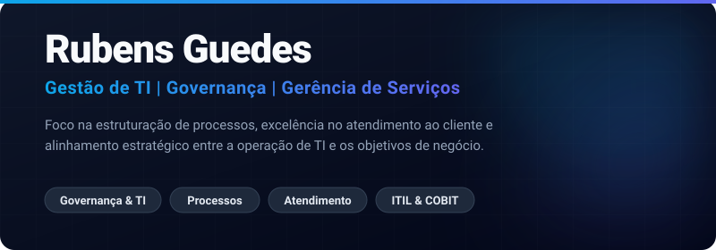

  

 

### 💼 Visão Executiva

Tenho sólida experiência em **Gestão, Governança e Gerência de TI**. Meu foco de atuação está voltado para a estruturação e otimização de **processos**, excelência na prestação de serviços (ITSM) e a melhoria contínua do **Atendimento ao Cliente**, impulsionando a operação corporativa com o uso estratégico de **Inteligência Artificial (IA)**. 

Meu objetivo central é garantir que a operação de TI funcione como uma engrenagem perfeitamente alinhada às necessidades do negócio, com processos maduros e foco absoluto na entrega de valor e satisfação do usuário.

---

### 🎯 O que você encontrará no meu GitHub

Criei este espaço como um acervo focado na estruturação e governança de operações de TI. Navegando pelos meus repositórios, você terá acesso a:

- 🤖 **Projetos de IA:** Experimentações, integrações e uso de Inteligência Artificial para ganho de eficiência.
- 🚀 **Automações Pessoais:** Ferramentas, scripts de governança e soluções focadas na gestão de TI.
- 📄 **Manuais e Documentações:** Guias estruturados para equipes de suporte, operações e atendimento.
- 🎯 **Boas Práticas e Políticas:** Diretrizes operacionais e frameworks baseados nas melhores práticas de mercado (ITIL/COBIT).
- 📊 **Modelos de Relatórios Gerenciais:** Templates focados no acompanhamento de KPIs, SLAs e métricas de satisfação.
- 📐 **Modelos de Processos:** Fluxos de atendimento, escalonamento e gestão de incidentes.
- 📚 **Materiais de Estudos:** Anotações, resumos e cases sobre governança e gestão de serviços.

---

### 🔄 Ecossistema de Processos e Relacionamento

- 🏢 **Estratégia e Negócios**
  - ⚖️ **Governança de TI**
    - ⚙️ **Gestão de Serviços (ITSM)** ➔ Suporte e Atendimento
    - 📈 **Gestão de Processos** ➔ Melhoria Contínua
  - 🤝 **Cliente Final (Relacionamento)**
    - 🔄 *Feedback e Geração de Valor*

---

### 📈 Distribuição de Foco (Áreas de Atuação)

  

---

### ⚙️ Metodologias e Inovação

  
  
  
  
  

 

  

